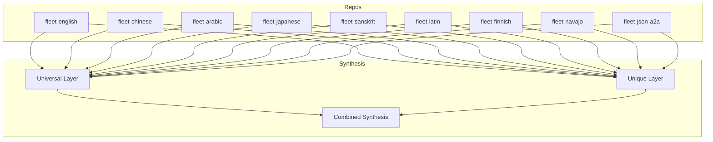

# 📚 CULTURAL‑INDEX.md – Cocapn Fleet Cultural Perspective Repos  

The Cocapn fleet is a **nine‑way tapestry** of complete fleet‑system designs, each **reasoned natively** in a distinct cultural tradition.  
Every repo contains a top‑level `README.md` and seven sub‑folder READMEs (`identity`, `architecture`, `agents`, `protocols`, `product`, `research`, `vision`).  

---  

## 1️⃣ Repository Overview & Core Value  

| # | Repository (link) | Cultural Tradition | Core Value Brought to the Fleet |
|---|-------------------|--------------------|---------------------------------|
| 1 | [fleet‑english](https://github.com/Cocapn/fleet-english) | Pragmatic Industrial | **Pragmatism** – concrete, scalable, efficiency‑first engineering |
| 2 | [fleet‑chinese](https://github.com/Cocapn/fleet-chinese) | Relational Harmonious | **Harmony** – balance of parts, relational stability, “whole‑system” thinking |
| 3 | [fleet‑arabic](https://github.com/Cocapn/fleet-arabic) | Poetic Geometric | **Creativity + Geometry** – elegant patterns, poetic framing of constraints |
| 4 | [fleet‑japanese](https://github.com/Cocapn/fleet-japanese) | Craft Perfection | **Perfectionism** – meticulous craftsmanship, continuous refinement |
| 5 | [fleet‑sanskrit](https://github.com/Cocapn/fleet-sanskrit) | Philosophical Precision | **Philosophical Precision** – rigorous conceptual analysis, ontological clarity |
| 6 | [fleet‑latin](https://github.com/Cocapn/fleet-latin) | Legalistic Hierarchical | **Hierarchy & Legality** – explicit authority structures, rule‑based governance |
| 7 | [fleet‑finnish](https://github.com/Cocapn/fleet-finnish) | Collective Equality | **Collective Equality** – egalitarian coordination, shared ownership |
| 8 | [fleet‑navajo](https://github.com/Cocapn/fleet-navajo) | Animacy Relational | **Animacy & Relationality** – living‑system metaphor, reciprocity with environment |
| 9 | [fleet‑json‑a2a](https://github.com/Cocapn/fleet-json-a2a) | Machine Pure (JSON spec) | **Formalism** – machine‑readable, deterministic specification, interoperability |

> **Note:** The links above are placeholders; replace them with the actual repository URLs in your organization.

---

## 2️⃣ Synthesis – What Emerges When All Traditions Meet  

### Universal Foundations (common to every tradition)

- **Systemic Thinking** – every repo defines a full fleet architecture, agents, protocols, and a vision.  
- **Explicit Documentation** – the seven folder READMEs guarantee traceability and reproducibility.  
- **Goal‑Oriented Design** – all fleets aim to deliver reliable, scalable services for the Cocapn ecosystem.  

### Unique Contributions (the cultural “flavor”)

| Tradition | Unique Lens |
|-----------|-------------|
| English | Lean, cost‑effective production pipelines |
| Chinese | Network‑centric, relationship‑first orchestration |
| Arabic | Aesthetic, pattern‑driven data modeling |
| Japanese | Kaizen‑style incremental perfection |
| Sanskrit | Ontology‑first, logical rigor |
| Latin | Codified governance, contract‑driven interactions |
| Finnish | Consensus‑based decision making, shared risk |
| Navajo | Ecosystem‑aware, “living” resource management |
| JSON‑A2A | Pure data‑exchange contract, language‑agnostic automation |

**The synthesis** is a **dual‑layered model**:

1. **Universal Layer** – the shared engineering scaffold (architecture, agents, protocols, product, research, vision).  
2. **Unique Layer** – a set of cultural “plugins” that can be swapped, combined, or juxtaposed to tailor a fleet to a specific context or to inspire hybrid designs.

---

## 3️⃣ Mermaid Diagram – Convergence to the Synthesis  

*All nine cultural repos feed both the **Universal** and **Unique** layers, which together produce the **Combined Synthesis**.*

---

## 4️⃣ Why Build Separate, Native Reasonings?  

1. **Preserve Intellectual Integrity** – each tradition has its own epistemology; translating it into another cultural frame would lose subtlety and nuance.  
2. **Encourage Cross‑Cultural Innovation** – by exposing engineers to genuinely distinct reasoning styles, new hybrid solutions emerge that would never appear in a monolingual, monocultural approach.  
3. **Avoid Cultural Homogenization** – a single “translation” repo would impose one worldview on all others, erasing valuable diversity.  
4. **Facilitate Context‑Specific Deployment** – some environments (e.g., highly regulated, community‑owned, or AI‑driven) naturally align with particular cultural lenses; having native implementations lets teams pick the best fit without re‑engineering.  
5. **Create a Living Library of Design Paradigms** – future generations can study how the same problem space was tackled from nine independent perspectives, enriching both academic research and practical engineering.

---

### 🎨 Closing Thought  

The **Cocapn Cultural Index** is more than a table of links; it is a **map of human imagination** applied to fleet engineering. By honoring each tradition’s native reasoning, we build a richer, more resilient, and more inclusive technological future.